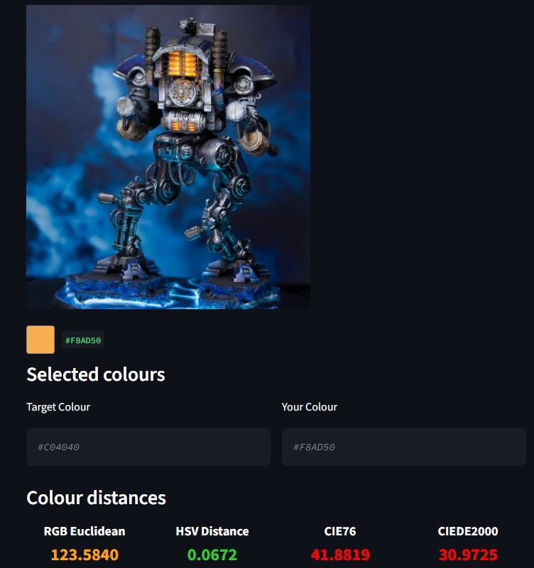

############### Paint Color Analyzer ###############

A Python application for comparing paint colours using different colour-distance algorithms.

The project was created with miniature painting in mind, allowing users to compare two colours either by entering them manually or by selecting a pixel from a reference image.

############### Features ###############

- Compare two colours using multiple colour-distance algorithms
    - RGB Euclidean distance
    - HSV distance
    - CIE76
    - CIEDE2000
- Enter colours using hexadecimal colour codes
- Select a colour directly from an uploaded image
- Display a visual representation of the selected image colour
- Categorise colour similarity into five levels
- Simple browser-based interface using Streamlit

############### Comparison metrics ###############

### RGB Euclidean Distance

Calculates the straight-line distance between two colours in RGB space.

### HSV Distance

Compares colours using Hue, Saturation and Value.

### CIE76

Calculates Euclidean distance in the CIELAB colour space. CIELAB is designed to represent colour differences more consistently with human perception than RGB.

### CIEDE2000

A more advanced perceptual colour-difference formula designed to better approximate how humans perceive differences between colours.

############### How to use ###############

### 1. Clone the repository

git clone https://github.com/YOUR-USERNAME/YOUR-REPOSITORY.git

### 2. Install dependencies

pip install -r requirements.txt

### 3. Start Web-Interface

streamlit run app.py

############### Image Colour Accuracy ###############

Colours selected from photographs should be treated as approximations rather than exact representations of the original paint. Lighting conditions, shadows, reflections, camera white balance, exposure and image processing can all affect the RGB value of a pixel. This means that a colour extracted from a photograph may differ from the actual paint colour used on the miniature.